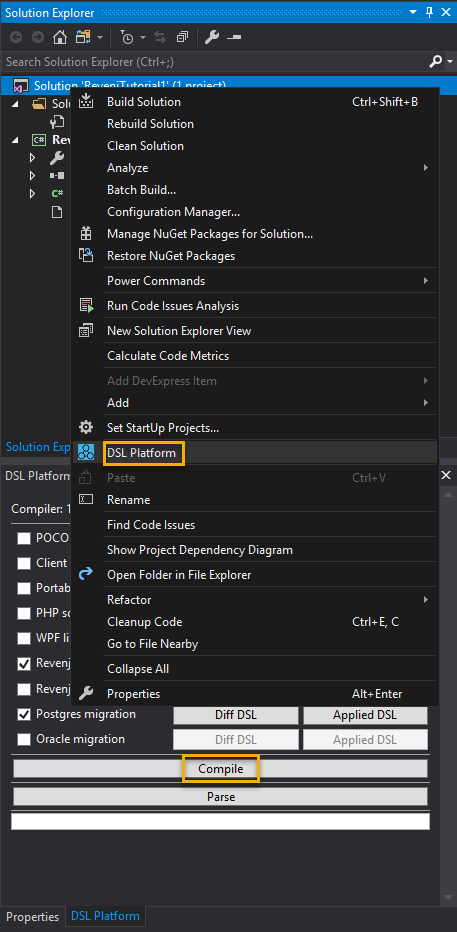
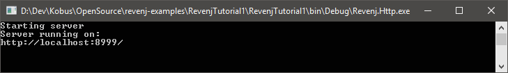

# Runnable Revenj tutorial example

This is a runnable example of the first basic Revenj tutorial found at
https://github.com/ngs-doo/revenj/blob/master/tutorials/revenj-tutorial-setup.md

It does not necessary follow best practices or my personal project structure but serves as an already set up example minimal project that is quick to clone, modify and run. 

I can use it as a base project for other examples so I do not need to repeat those tutorial steps again.


## Prerequisites
1. Install [PostgreSQL](https://www.postgresql.org/download/windows/) 9.6 or 10
2. [Create](https://www.postgresql.org/docs/current/static/tutorial-createdb.html) a database named **revenjtutorial1**  :information_source: The name is case sensitive
    ```
    createdb -U postgres -E UTF8 revenjtutorial1
    ```
3. Install the [DDD for DSL Platform extension](https://marketplace.visualstudio.com/items?itemName=RikardPavelic.DDDforDSLPlatform) :information_source: Currently need to [edit](http://answers.perforce.com/articles/KB/15254/?q=changing+workspace+using+p4+command+client&l=en_US&fs=RelatedArticle) *DDDLanguage.vsix* to install it in Visual Studio 2017

## Instructions
1. Open the solution in Visual Studio
2. Open the *DSL Platform* window
* Right click on the solution and click *DSL Platform*
* or click the *View\Other Windows\DSL Platform* menu item

3. Click the *Compile* button to compile and click *Confirm* apply the sql migration
4. Debug/Run the solution 
    

## Remarks
* The screenshots in the Revenj tutorial are outdated
* I've checked *Create directory for solution* in the *New Project* dialog because I wanted to commit the *.sln* file as well
* I've added [build events](https://github.com/Kobus-Smit/revenj-examples/blob/1e61e123de52c46712632ba3d8eff2170bd57e78/RevenjTutorial1/RevenjTutorial1/RevenjTutorial1.csproj#L54) to copy the [PostgresModel.dll](https://github.com/Kobus-Smit/revenj-examples/blob/master/RevenjTutorial1/lib/PostgresModel.dll) and [Revenj dependencies](https://github.com/Kobus-Smit/revenj-examples/tree/master/RevenjTutorial1/dependencies/Postgres)
* I've modified the [.csproj](https://github.com/Kobus-Smit/revenj-examples/blob/1e61e123de52c46712632ba3d8eff2170bd57e78/RevenjTutorial1/RevenjTutorial1/RevenjTutorial1.csproj#L19-L21) file to use a [relative path](https://stackoverflow.com/questions/4774745/using-relative-path-for-start-external-program-in-vs-net-2010/4775221) to start *Revenj.Http.exe*
* I've included the [Revenj.Http.exe.config](https://github.com/Kobus-Smit/revenj-examples/blob/master/RevenjTutorial1/dependencies/Postgres/Revenj.Http.exe.config)  as a Solution Item so I can quickly change settings from within Visual Studio. :information_source: You need to **Rebuild** the solution if you make changes to this file
